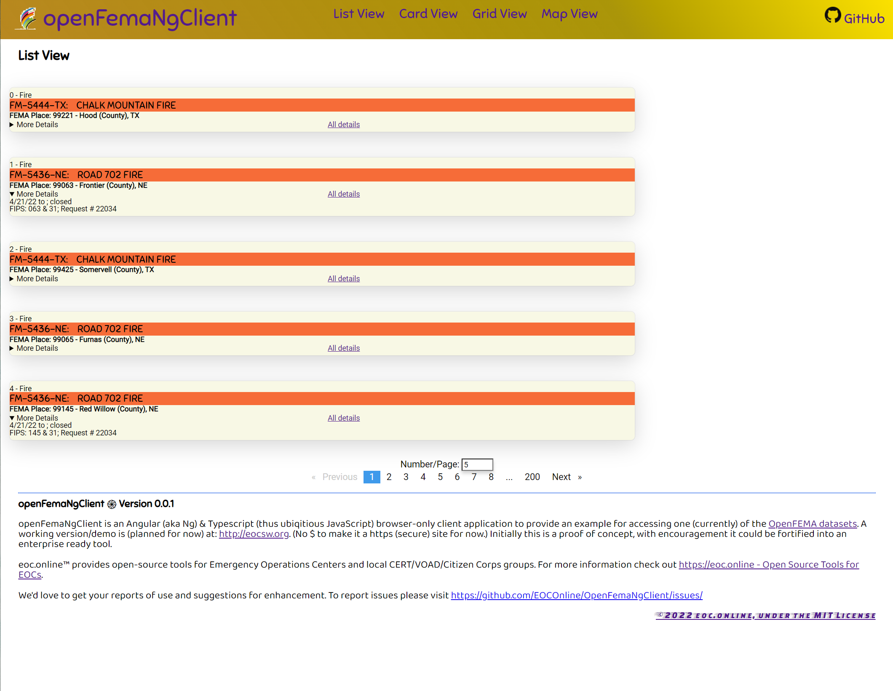
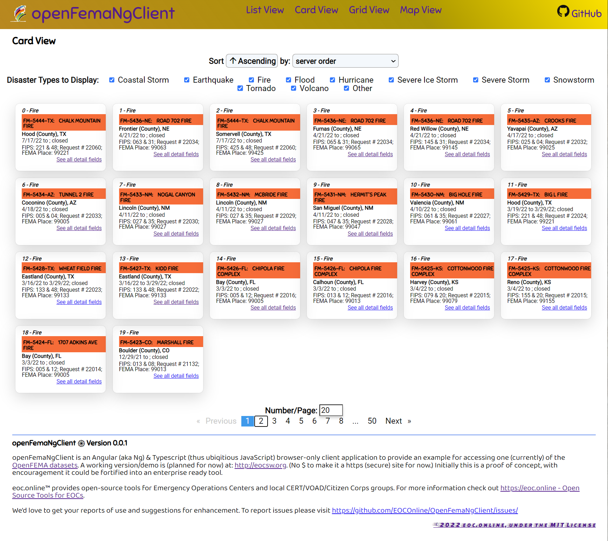
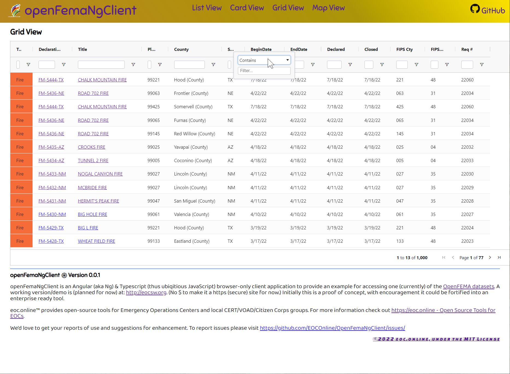
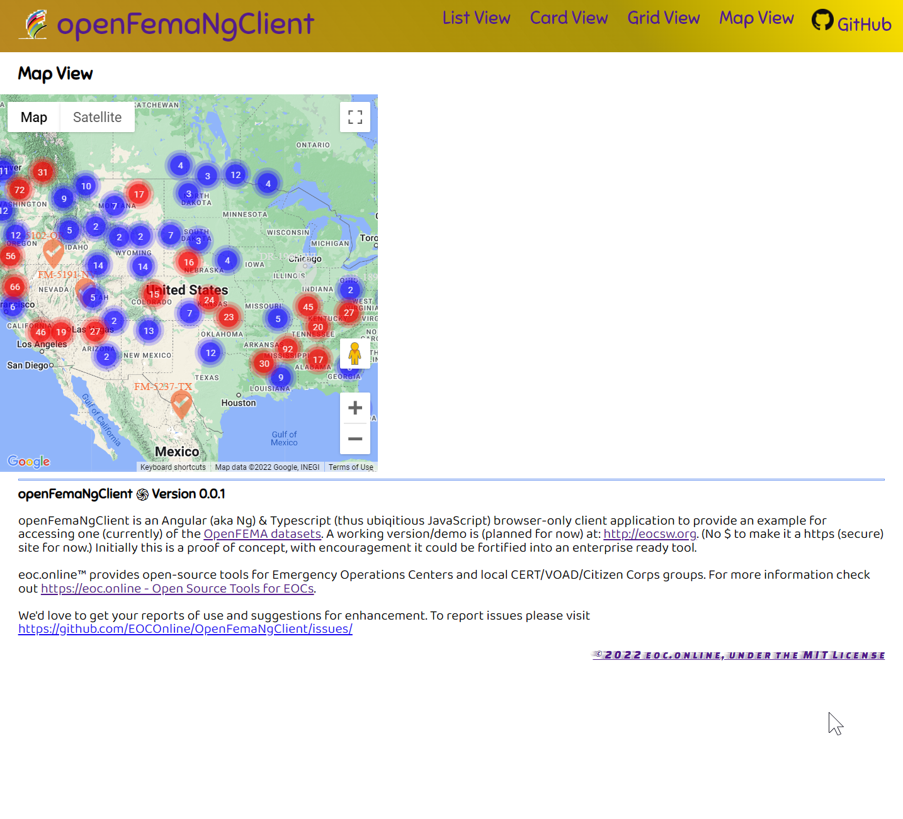
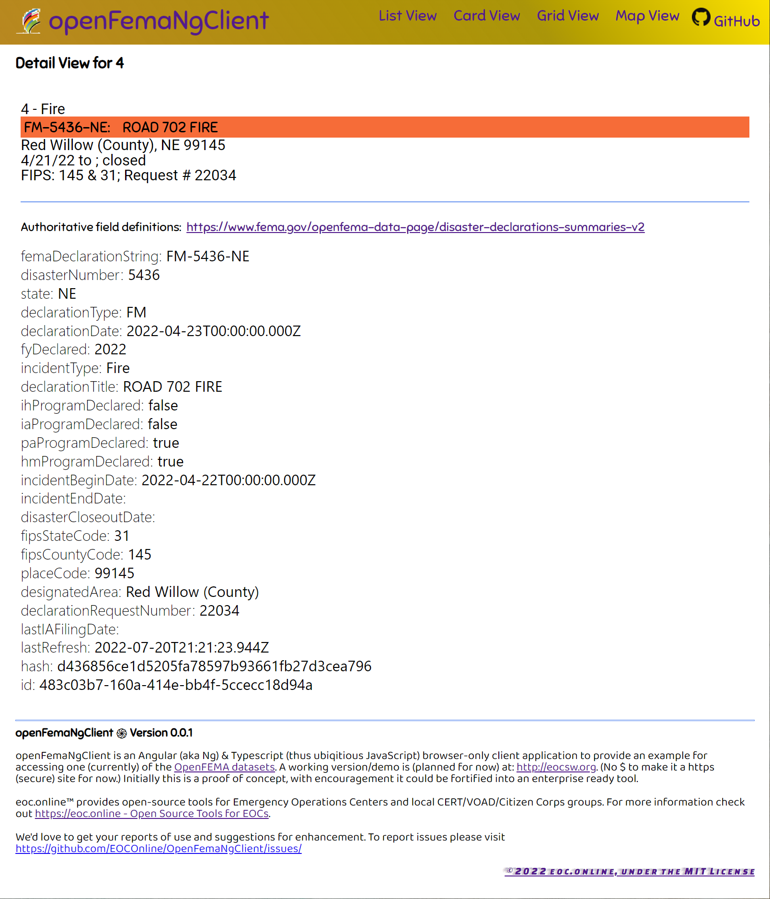

# OpenFemaNgClient

<!-- https://docs.github.com/en/get-started/writing-on-github/getting-started-with-writing-and-formatting-on-github/basic-writing-and-formatting-syntax -->

<!-- picture>
 <source media="(prefers-color-scheme: dark)" srcset="YOUR-DARKMODE-IMAGE">
 <source media="(prefers-color-scheme: light)" srcset="YOUR-LIGHTMODE-IMAGE">
 
</picture -->

FEMA has released a wide variety of data for public use over the last decade. Their OpenFEMA project provides extensive, historic disaster-related data. It is well documented at: <https://www.fema.gov/about/reports-and-data/openfema>. However there are not many samples illustrating ways to display and analyze the data without advanced programming skills.

OpenFemaNgClient is an Angular (i.e., 'Ng') and Typescript application that provides one such sample approach for accessing a few of these data sets with ubiqitious JavaScript. Initially this is a proof of concept, with encouragement it could be fortified into an enterprise ready tool!

## Features

- Displays dataset using List, Card, Ag-Grid Grid and Google Map views
- Also displays a Detailed view showing all data fields.
- Provides a coding sample using latest versions of Angular & Typescript
- Open Source, freely available using the permisive MIT license

### Screenshots

#### List View

#### Card View

#### Grid View

#### Map View

#### Detail View

## Known/Planned Issues

- [ ] Only displays the Disaster Declarations dataset
- [ ] Only brings in the top 1000 rows for now
- [ ] Doesn't have practical analysis

## Roadmap

With encouragement :+1: /funding:

- [ ] Select any of the datasets for display
- [ ] Support access to key API parameters
- [ ] Move 'View' component code to an 'abstract' class where possible for consistency and streamlined sharing of code
- [ ] More analysis & filtering options to aid analysis/investigation
- [ ] Trend displays

## Build & Run this web app

1. Install Node Js <https://nodejs.org/en/download> and NPM <https://docs.npmjs.com/downloading-and-installing-node-js-and-npm>.
2. Fork, Clone, or Copy the source code from the <www.GitHub.com/EOConline/OpenFemaNgClient> repository to a directory on your dev workstation
3. From a command line in that directory, enter `npm install` to install all the required 3rd party libraries
4. Enter `n g -o` (shorthand for `ng serve -output`) to compile the application and serve it using the build-in development server and open your default browser to this location.

### Development server

Run `ng serve` for a dev server. Navigate to `http://localhost:4200/`. (Or do the previous more succinctly with just `ng s -o`.) The application will automatically reload if you change any of the source files.

### Build

Run `ng build` to build the project. The build artifacts will be stored in the `dist/` directory.

### Updating Angular Libraries & Build Environment

This project was generated with [Angular CLI](https://github.com/angular/angular-cli) version 15.

To update libraries in the future: either use Evergreen Angular extension or use the same commands from package.json directly: Start with a clean repository: checkin any outstanding code updates. You likely need do this periodically between the following steps.

- `npm run update1` (i.e., `npx ng update @angular/core @angular/cli --next`)
- `npm run update2` (i.e., `npx ng update --next`)
  - Update any packages as listed by the above command, e.g., `ng update @angular/cli @angular/core @angular/google-maps --next`
- `npm run update3` (i.e., `npx npm-check-updates --next`)
- `npm run update4` (i.e., `npx npm-check-updates -u`) which updates package.json to the latest format - only if requested by the previous command
- `npm run update5` (i.e., `npm install`)
- `npm run update6` (i.e., `npm i -g rimraf` Post-Update Checkup)

### Running unit tests

Run `ng test` to execute the unit tests via [Karma](https://karma-runner.github.io).

### Further help

To get more help on the Angular CLI use `ng help` or go check out the [Angular CLI Overview and Command Reference](https://angular.io/cli) page.

## Public Feedback & Contribution

We encourage your feedback and contributions to this repository. Content suggestions and discussions (specific to OpenFemaNgClient) can be communicated in the following ways:

- GitHub “issues.” Each issue is a conversation about specific project work initiated by a member of the public.
- GitHub "discussions". Each discussion is a project communication forum. Discussions are not specific to elements of work like a pull request. We encourage you to browse and join in on discussions or start a new conversation by creating a new discussion.
- Direct changes and line edits to the content may be submitted through a "pull request" by clicking "Edit this page" on any site page in the repository. You do not need to install any software to suggest a change. You can use GitHub's in-browser editor to edit files and submit a pull request for your changes to be merged into the document. Directions on how to submit a pull request can be found on GitHub.
- Send your content suggestions or proposed revisions to the OpenFemaNgClient team via email to OpenFemaNgClient@eoc.online.

## eoc.online

<http://eoc.online> provides free tools for Emergency Operations Centers and local CERT/VOAD/Citizen Corps groups. For more information check out <http://eoc.online>. We'd LOVE to get your reports of use and suggestions for enhancement.

To report issues please visit <https://github.com/EOCOnline/OpenFemaNgClient/issues>.

©2022 eoc.online, under the MIT License
